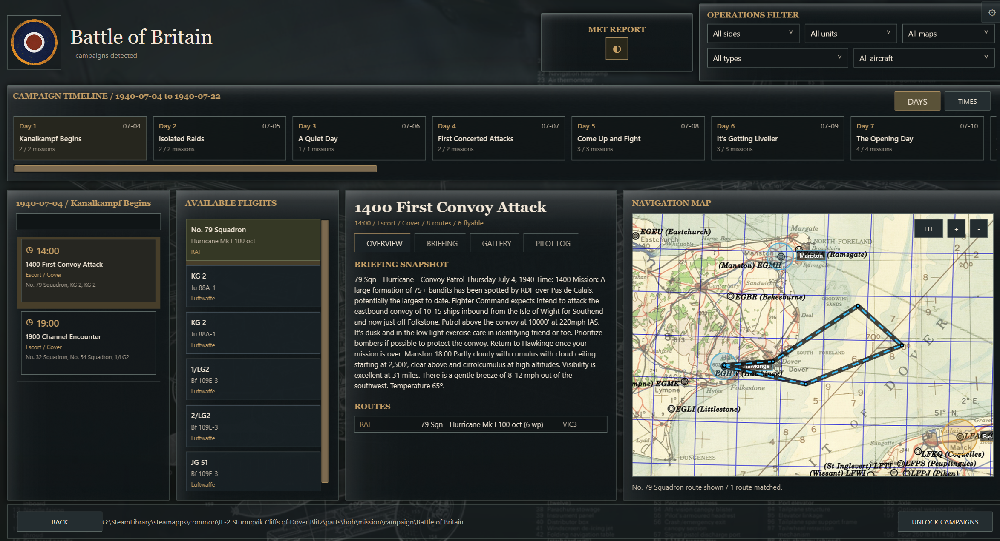
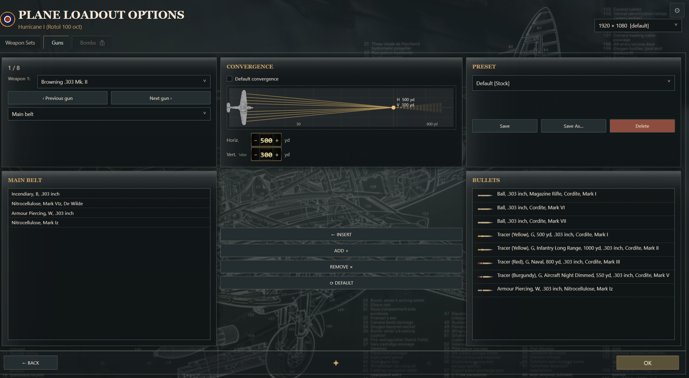

# IL-2 Sturmovik: Cliffs of Dover UI Overhaul Prototype

This repository is a WPF/XAML/C# prototype of a recreated IL-2 Sturmovik: Cliffs of Dover front end. It began as a loadout-screen experiment and has grown into a broader front-end mockup covering the main menu, options, pilot/aircraft screens, single missions, quick missions, and a much more advanced campaign selector/campaign board.

The project is designed as a working prototype and integration reference. It is not currently wired into the real game engine, but the code is structured so the file-system scanners and prototype services can later be replaced by game-owned services.


## Current Scope

- Main menu and front-end navigation flow.
- Single player menu.
- Campaign selector.
- Campaign board with timeline, filters, briefing, gallery, pilot log, met report, and route map.
- Single mission browser with banner, parsed briefing text, mission metadata, and route map.
- Quick mission placeholder/scanner flow.
- Multiplayer, options, controls, realism, statistics, training, credits, pilot, aircraft, and loadout screens.
- Shared Cliffs of Dover themed styling in `Theme.xaml`.
- 3D aircraft and pilot preview panels using HelixToolkit.
- File-system parsing for vanilla Cliffs of Dover, Tobruk, and nested custom campaign structures.

## Requirements

- Windows.
- .NET 8 SDK for development.
- .NET 8 Windows Desktop Runtime if running a framework-dependent build.
- Visual Studio 2022, Rider, or VS Code is optional but useful.

The published Team Fusion preview build is self-contained, so testers do not need the .NET SDK.

## Running From Source

From the repository folder:

```powershell
dotnet restore --ignore-failed-sources
dotnet run --project .\PlaneLoadoutWpfTest.csproj
```

If NuGet is offline but the packages are already cached locally, `--ignore-failed-sources` avoids failing only because package vulnerability checks cannot reach nuget.org.

`dotnet run` should also work from the repository root because there is only one root project file. `run.bat` launches the same development build explicitly.

## Building

Development build:

```powershell
dotnet build
```

Release publish:

```powershell
dotnet publish .\Packaging\CliffsOfDoverUiOverhaul.Package.csproj -c Release -r win-x64 --self-contained true -p:PublishSingleFile=true -p:IncludeNativeLibrariesForSelfExtract=true -o .\publish\TeamFusion-CliffsOfDoverUiOverhaul-win-x64
```

The packaging project lives under `Packaging/` so it does not interfere with normal `dotnet run` usage from the repository root. A self-contained publish may need a one-time online restore for Windows desktop runtime packs if they are not already cached.

The 3D model assets and map calibration file are deliberately kept as loose files beside the executable, because the 3D loader reads OBJ/MTL/texture files from normal file paths at runtime.

## Project Structure

```text
Assets/                         UI images, maps, insignia, 3D models, textures
Controls/                       Shared custom controls such as ModelViewer3D
Screens/                        WPF UserControls for each front-end screen
Services/                       Navigation, settings, parsers, scanners, exports, pilot log
Theme.xaml                      Shared styles and visual theme
App.xaml / MainWindow.xaml      WPF app shell
PlaneLoadoutWpfTest.csproj      Main development project
Packaging/                      Optional release packaging project
Map_Calibration_data.txt        Strait of Dover and Tobruk calibration points
```

## Important Services

- `Services/CampaignSelectionService.cs`
  - Discovers campaign entries for the campaign selector.
  - Reads vanilla `campaigns.ini` data where available.
  - Also discovers nested custom campaigns such as ATAG_Lenny-style campaign folders.

- `Services/CampaignBoardService.cs`
  - Parses campaign mission folders, `.mis`, `.briefing`, `.cs`, and route data.
  - Builds the model used by the campaign board.
  - Infers dates, times, sides, aircraft, mission types, routes, slides, weather, and map data.

- `Services/MissionScannerService.cs`
  - Scans single and quick mission folders.
  - Parses mission title, map/theatre, time, briefing, banner imagery, and routes.

- `Services/CampaignBoardExportService.cs`
  - Exports parsed campaign JSON and Markdown parser reports for diagnostics.

- `Services/PilotLogService.cs`
  - Stores prototype pilot log entries locally.

- `Services/CampaignIntegrationContracts.cs`
  - Suggested boundary contracts for future game-side integration.

## Mission And Campaign Search Paths

When given a Cliffs of Dover game root, the prototype looks in paths such as:

```text
missions\Single\
parts\bob\mission\campaign\
parts\bob\mission\Quick\
parts\bob\missions\Single\
parts\tobruk\mission\campaign\
parts\tobruk\mission\Quick\
parts\tobruk\missions\Single\
```

When given the player documents root, it looks in:

```text
1C SoftClub\il-2 sturmovik cliffs of dover\missions\single\
1C SoftClub\il-2 sturmovik cliffs of dover\mission\campaign\
1C SoftClub\il-2 sturmovik cliffs of dover\mission\quick\
```

Multiplayer paths are documented but are not currently used by the campaign browser.

## Campaign Board Highlights



- Campaign selector screen before the board.
- Theatre filtering for Strait of Dover and Tobruk.
- Campaign poster and description preview where campaign briefing/poster files exist.
- Day timeline with filtered days.
- Time-of-day mission tiles.
- Available flight tiles with RAF/Luftwaffe/Regia colour treatment.
- Route map showing the selected playable flight route, not all enemy routes.
- Map calibration support for Strait of Dover and Tobruk.
- Enemy sighting markers extracted from briefing text where possible.
- Met report widget.
- Manual pilot log prototype.
- Gallery and briefing views.

## Aircraft And Loadout Screens




The aircraft configuration and loadout screens recreate the broader front-end flow around aircraft defaults, armament, gun convergence, and aircraft/pilot preview panels. These screens are prototype UI references and are not currently connected to the real game loadout systems.

## 3D Model Notes

The aircraft and pilot previews use OBJ/MTL assets under `Assets/3d/`.

Important:

- Do not bundle `Assets/3d/**` inside a single-file EXE.
- These files must remain loose beside the executable.
- `ww2_Pilot.obj`, `ww2_Pilot.mtl`, and `textures/ww2_Pilot.png` are the cleaned pilot asset chain.

If the app shows cube placeholders, check that the OBJ, MTL, and texture files exist beside the executable in `Assets/3d/`.

## Documentation

- `CAMPAIGN_BOARD_SPEC.md`
  - Campaign board model and parser behaviour.

- `MISSION_DATA_PARSING.md`
  - Current WPF parser notes for campaign, single mission, quick mission, maps, and route data.

- `MISSION_FILE_STRUCTURE_GUIDE.md`
  - Standalone field guide for another chat/tool to understand Cliffs of Dover `.mis`, `.briefing`, `.cs`, campaign folders, roles, routes, and mission-generation risks.

- `GAME_FRONTEND_INTEGRATION_GUIDE.md`
  - Suggested interface layer for replacing prototype services with game-owned services.

- `INTERNAL_GAME_TEAM_HANDOFF.md`
  - Practical notes for Team Fusion/internal programmers reviewing the prototype.

- `RELEASE_NOTES.md`
  - Current preview release notes.

- `Missions_Folders.txt`
  - Search path reference.

## Repository Hygiene

Generated folders should not be committed:

```text
bin/
obj/
publish/
build-check-output*/
```

Generated executables and zip files should go to GitHub Releases, not the source repository.

Large assets in `Assets/3d/` are good candidates for Git LFS if the repository will be maintained long-term.

The project uses normal NuGet package references on a fresh machine. If HelixToolkit is already cached locally, the project can use the cached DLLs directly so development still works when NuGet is temporarily unavailable.

## Current Limitations

- Mission launching is still a prototype button flow and is not connected to the real game launcher.
- Campaign progress/unlock handling is prototype-level.
- Parser behaviour is heuristic because vanilla campaigns, Tobruk campaigns, quick missions, single missions, and custom campaigns all structure data differently.
- The app is not code-signed.
- Some game-front-end behaviours will need real game services rather than direct file parsing.

## Recommended Next Steps

1. Keep improving parser diagnostics with real campaign samples.
2. Replace static prototype services with interfaces from `CampaignIntegrationContracts.cs`.
3. Connect launch buttons to a game-owned mission launch service.
4. Replace local pilot log storage with game-owned sortie/career data.
5. Review large assets and enable Git LFS if this becomes a long-lived GitHub repository.
